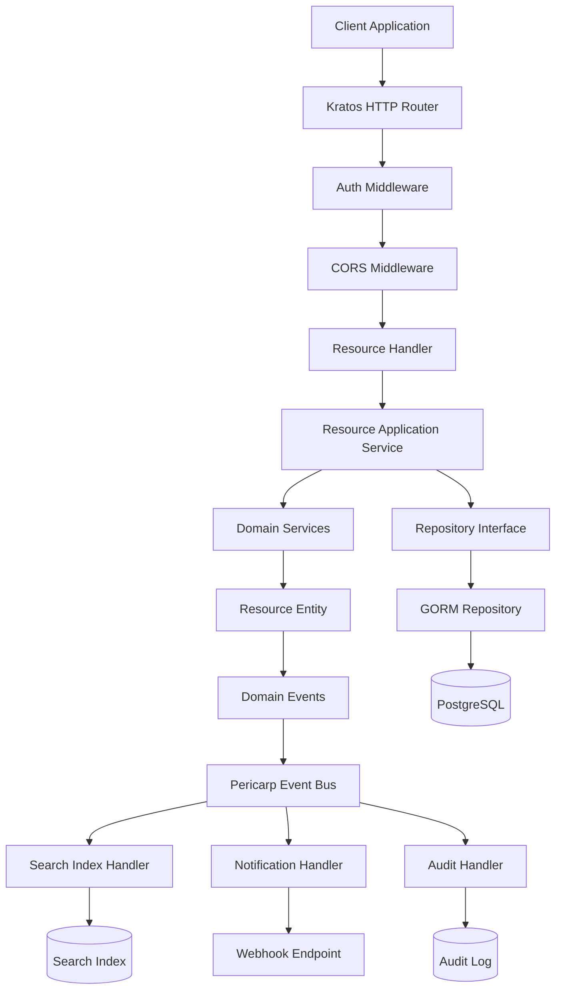
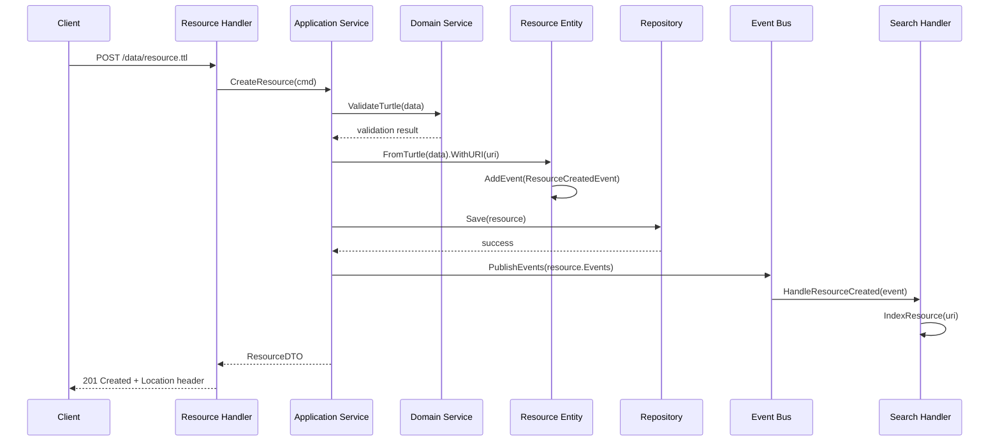
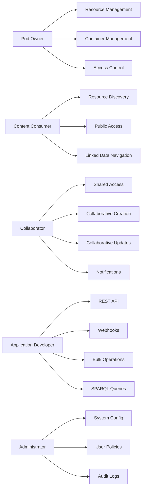

# Solid Server Design for Vine Pod

## Executive Summary

This document outlines the design for implementing a Solid Protocol-compliant Linked Data Platform (LDP) server as a Go microservice. The design follows Domain-Driven Design (DDD) principles, uses the pericarp core library for event sourcing, and implements the Solid Protocol and LDP specifications.

## Architecture Overview

### Tech Stack Integration
- **Go 1.24+** with Kratos HTTP framework
- **Pericarp** for DDD domain modeling and event sourcing
- **GORM** for data persistence (PostgreSQL/SQLite)
- **Fx** for dependency injection
- **Zap** for structured logging
- **Moq** for test mocks
- **TDD/BDD** testing approach

### Domain Model Design

Based on Solid Protocol and LDP specifications, the core domain entities are:

#### 1. Domain Events (Strongly Typed)

```go
// Resource Events
type ResourceCreatedFromJSONLDEvent struct {
    ResourceID  string
    Data        string
    ContentType string
    CreatedAt   time.Time
}

type ResourceCreatedFromTurtleEvent struct {
    ResourceID  string
    Data        string
    ContentType string
    CreatedAt   time.Time
}

type ResourceCreatedFromRDFXMLEvent struct {
    ResourceID  string
    Data        string
    ContentType string
    CreatedAt   time.Time
}

type ResourceURIAssignedEvent struct {
    ResourceID  string
    URI         string
    AssignedAt  time.Time
}

type ResourceAddedToContainerEvent struct {
    ResourceID   string
    ContainerURI string
    AddedAt      time.Time
}

type ResourceUpdatedEvent struct {
    ResourceID  string
    Data        string
    ContentType string
    UpdatedAt   time.Time
}

type ResourceDeletedEvent struct {
    ResourceID  string
    DeletedAt   time.Time
}

// Container Events
type ContainerCreatedEvent struct {
    ContainerID   string
    ContainerType string
    CreatedAt     time.Time
}

type ContainerMemberAddedEvent struct {
    ContainerID string
    MemberURI   string
    AddedAt     time.Time
}

type ContainerMemberRemovedEvent struct {
    ContainerID string
    MemberURI   string
    RemovedAt   time.Time
}

type ContainerMembershipRulesSetEvent struct {
    ContainerID              string
    MembershipResource       string
    HasMemberRelation        string
    InsertedContentRelation  string
    SetAt                    time.Time
}

// Access Policy Events
type AccessPolicyCreatedEvent struct {
    PolicyID     string
    ResourceURI  string
    CreatedAt    time.Time
}

type PermissionGrantedEvent struct {
    PolicyID    string
    AgentWebID  string
    Modes       []string
    GrantedAt   time.Time
}

type PermissionRevokedEvent struct {
    PolicyID    string
    AgentWebID  string
    Modes       []string
    RevokedAt   time.Time
}

type InheritanceSetEvent struct {
    PolicyID    string
    Inherit     bool
    SetAt       time.Time
}
```

#### 2. Resource Interface & Implementations

```go
// Resource interface defines the contract for all LDP resources
type Resource interface {
    // Core pericarp methods
    ID() string
    AddEvent(event domain.Event)
    AddError(err error)
    HasErrors() bool
    GetErrors() []error

    // Resource construction methods
    FromJSONLD(data string) Resource
    FromTurtle(data string) Resource
    FromRDFXML(data string) Resource
    WithURI(uri string) Resource
    WithContainer(containerURI string) Resource

    // Resource operations
    Update(data string, contentType string) Resource
    Delete() Resource

    // Resource metadata
    GetResourceType() ResourceType
    IsContainer() bool
}

// BasicResource - concrete implementation of Resource interface
type BasicResource struct {
    domain.Entity  // Embedded pericarp entity
}

// From/With constructor pattern for atomic instantiation
func (r *BasicResource) FromJSONLD(data string) Resource {
    // Validate and parse JSON-LD to extract ID
    if data == "" {
        r.AddError(errors.New("empty JSON-LD data"))
        return r
    }

    // Parse JSON-LD to extract the @id field
    var jsonLD map[string]interface{}
    if err := json.Unmarshal([]byte(data), &jsonLD); err != nil {
        r.AddError(fmt.Errorf("invalid JSON-LD: %w", err))
        return r
    }

    // Extract @id from JSON-LD
    resourceID, ok := jsonLD["@id"].(string)
    if !ok || resourceID == "" {
        r.AddError(errors.New("missing or invalid @id in JSON-LD"))
        return r
    }

    // Initialize entity with ID from the resource content
    if r.ID() == "" {
        r.Entity = domain.NewEntity(resourceID)
    }

    // Add strongly typed creation event
    event := ResourceCreatedFromJSONLDEvent{
        ResourceID:  resourceID,
        Data:        data,
        ContentType: "application/ld+json",
        CreatedAt:   time.Now(),
    }
    r.AddEvent(event)  // Automatically manages version and sequence
    return r
}

func (r *Resource) FromTurtle(data string) *Resource {
    if data == "" {
        r.AddError(errors.New("empty Turtle data"))
        return r
    }

    // Parse Turtle to extract the subject URI (resource ID)
    resourceID, err := extractSubjectFromTurtle(data)
    if err != nil {
        r.AddError(fmt.Errorf("failed to extract resource ID from Turtle: %w", err))
        return r
    }

    if resourceID == "" {
        r.AddError(errors.New("missing resource URI in Turtle data"))
        return r
    }

    // Initialize entity with ID from the resource content
    if r.ID() == "" {
        r.Entity = domain.NewEntity(resourceID)
    }

    event := domain.NewEvent(r.ID(), "Resource", "CreatedFromTurtle", map[string]interface{}{
        "data": data,
        "content_type": "text/turtle",
        "resource_uri": resourceID,
        "created_at": time.Now(),
    })
    r.AddEvent(event)
    return r
}

func (r *BasicResource) WithURI(uri string) Resource {
    if uri == "" {
        r.AddError(errors.New("invalid URI"))
        return r
    }

    event := ResourceURIAssignedEvent{
        ResourceID: r.ID(),
        URI:        uri,
        AssignedAt: time.Now(),
    }
    r.AddEvent(event)
    return r
}

func (r *BasicResource) WithContainer(containerURI string) Resource {
    if containerURI == "" {
        r.AddError(errors.New("invalid container URI"))
        return r
    }

    event := ResourceAddedToContainerEvent{
        ResourceID:   r.ID(),
        ContainerURI: containerURI,
        AddedAt:      time.Now(),
    }
    r.AddEvent(event)
    return r
}

func (r *BasicResource) Update(data string, contentType string) Resource {
    if data == "" {
        r.AddError(errors.New("empty update data"))
        return r
    }

    event := ResourceUpdatedEvent{
        ResourceID:  r.ID(),
        Data:        data,
        ContentType: contentType,
        UpdatedAt:   time.Now(),
    }
    r.AddEvent(event)
    return r
}

func (r *BasicResource) Delete() Resource {
    event := ResourceDeletedEvent{
        ResourceID: r.ID(),
        DeletedAt:  time.Now(),
    }
    r.AddEvent(event)
    return r
}

func (r *BasicResource) GetResourceType() ResourceType {
    return RDFSource // Default for BasicResource
}

func (r *BasicResource) IsContainer() bool {
    return false // BasicResource is not a container
}

// Helper functions for parsing different RDF formats
func extractSubjectFromTurtle(data string) (string, error) {
    // Parse Turtle data to extract the subject URI
    // This would use a Turtle parser library to find the main subject
    // For now, simplified example - in reality would use proper RDF parsing
    lines := strings.Split(data, "\n")
    for _, line := range lines {
        line = strings.TrimSpace(line)
        if strings.HasPrefix(line, "<") && strings.Contains(line, ">") {
            // Extract URI between < >
            start := strings.Index(line, "<")
            end := strings.Index(line[start+1:], ">")
            if end > 0 {
                return line[start+1 : start+1+end], nil
            }
        }
    }
    return "", errors.New("no subject URI found in Turtle data")
}

func extractSubjectFromRDFXML(data string) (string, error) {
    // Parse RDF/XML to extract rdf:about attribute
    // Would use proper XML/RDF parsing library
    // Simplified example for illustration
    if strings.Contains(data, "rdf:about=") {
        start := strings.Index(data, "rdf:about=\"")
        if start >= 0 {
            start += len("rdf:about=\"")
            end := strings.Index(data[start:], "\"")
            if end > 0 {
                return data[start : start+end], nil
            }
        }
    }
    return "", errors.New("no rdf:about URI found in RDF/XML data")
}

// Resource types as constants for event data
type ResourceType string
const (
    LDPResource     ResourceType = "ldp:Resource"
    RDFSource       ResourceType = "ldp:RDFSource"
    NonRDFSource    ResourceType = "ldp:NonRDFSource"
    BasicContainer  ResourceType = "ldp:BasicContainer"
    DirectContainer ResourceType = "ldp:DirectContainer"
    IndirectContainer ResourceType = "ldp:IndirectContainer"
)

// Additional From methods for other RDF formats
func (r *Resource) FromRDFXML(data string) *Resource {
    if data == "" {
        r.AddError(errors.New("empty RDF/XML data"))
        return r
    }

    // Parse RDF/XML to extract the resource URI
    resourceID, err := extractSubjectFromRDFXML(data)
    if err != nil {
        r.AddError(fmt.Errorf("failed to extract resource ID from RDF/XML: %w", err))
        return r
    }

    if resourceID == "" {
        r.AddError(errors.New("missing resource URI in RDF/XML data"))
        return r
    }

    // Initialize entity with ID from the resource content
    if r.ID() == "" {
        r.Entity = domain.NewEntity(resourceID)
    }

    event := domain.NewEvent(r.ID(), "Resource", "CreatedFromRDFXML", map[string]interface{}{
        "data": data,
        "content_type": "application/rdf+xml",
        "resource_uri": resourceID,
        "created_at": time.Now(),
    })
    r.AddEvent(event)
    return r
}
```

#### 2. Container Interface & Implementation

```go
// Container interface extends Resource with container-specific methods
type Container interface {
    Resource // Embeds all Resource interface methods

    // Container-specific operations
    AddMember(memberURI string) Container
    RemoveMember(memberURI string) Container
    WithMembershipRules(membershipResource, hasMemberRelation, insertedContentRelation string) Container
    GetContainerType() ContainerType

    // Container construction methods
    FromType(containerType string) Container
}

// BasicContainer - concrete implementation of Container interface
type BasicContainer struct {
    domain.Entity  // Embedded pericarp entity
}

// From/With constructor pattern for containers
func (c *Container) FromType(containerType string) *Container {
    if c.Entity.ID() == "" {
        c.Entity = domain.NewEntity("")
    }

    validTypes := []string{"ldp:BasicContainer", "ldp:DirectContainer", "ldp:IndirectContainer"}
    if !contains(validTypes, containerType) {
        c.AddError(errors.New("invalid container type"))
        return c
    }

    event := ContainerCreatedEvent{
        ContainerID:   c.ID(),
        ContainerType: containerType,
        CreatedAt:     time.Now(),
    }
    c.AddEvent(event)
    return c
}

// BasicContainer implements all Resource interface methods plus Container-specific methods
func (c *BasicContainer) AddMember(memberURI string) Container {
    if memberURI == "" {
        c.AddError(errors.New("invalid member URI"))
        return c
    }

    event := ContainerMemberAddedEvent{
        ContainerID: c.ID(),
        MemberURI:   memberURI,
        AddedAt:     time.Now(),
    }
    c.AddEvent(event)
    return c
}

func (c *BasicContainer) RemoveMember(memberURI string) Container {
    if memberURI == "" {
        c.AddError(errors.New("invalid member URI"))
        return c
    }

    event := ContainerMemberRemovedEvent{
        ContainerID: c.ID(),
        MemberURI:   memberURI,
        RemovedAt:   time.Now(),
    }
    c.AddEvent(event)
    return c
}

func (c *BasicContainer) WithMembershipRules(membershipResource, hasMemberRelation, insertedContentRelation string) Container {
    event := ContainerMembershipRulesSetEvent{
        ContainerID:             c.ID(),
        MembershipResource:      membershipResource,
        HasMemberRelation:       hasMemberRelation,
        InsertedContentRelation: insertedContentRelation,
        SetAt:                   time.Now(),
    }
    c.AddEvent(event)
    return c
}

// Resource interface implementations for BasicContainer
func (c *BasicContainer) FromJSONLD(data string) Resource { /* ... implementation ... */ }
func (c *BasicContainer) FromTurtle(data string) Resource { /* ... implementation ... */ }
func (c *BasicContainer) FromRDFXML(data string) Resource { /* ... implementation ... */ }
func (c *BasicContainer) WithURI(uri string) Resource { /* ... implementation ... */ }
func (c *BasicContainer) WithContainer(containerURI string) Resource { /* ... implementation ... */ }
func (c *BasicContainer) Update(data string, contentType string) Resource { /* ... implementation ... */ }
func (c *BasicContainer) Delete() Resource { /* ... implementation ... */ }

func (c *BasicContainer) GetResourceType() ResourceType {
    return BasicContainerType
}

func (c *BasicContainer) IsContainer() bool {
    return true
}

func (c *BasicContainer) GetContainerType() ContainerType {
    return BasicContainerType
}

// Factory functions
func NewBasicResource() Resource {
    return &BasicResource{}
}

func NewBasicContainer() Container {
    return &BasicContainer{}
}

// Container type enumeration
type ContainerType string
const (
    BasicContainerType    ContainerType = "ldp:BasicContainer"
    DirectContainerType   ContainerType = "ldp:DirectContainer"
    IndirectContainerType ContainerType = "ldp:IndirectContainer"
)
```

#### 3. AccessPolicy (Aggregate Root)
```go
// Atomic access policy entity - no child storage, only events
type AccessPolicy struct {
    *pericarp.BasicEntity
}

// From/With constructor pattern for access policies
func (a *AccessPolicy) ForResource(resourceURI string) *AccessPolicy {
    if a.BasicEntity == nil {
        a.BasicEntity = pericarp.NewBasicEntity("")
    }

    if resourceURI == "" {
        a.AddError(errors.New("invalid resource URI"))
        return a
    }

    event := pericarp.NewEvent(a.ID(), "AccessPolicy", "Created", map[string]interface{}{
        "resource_uri": resourceURI,
        "created_at": time.Now(),
    })
    a.AddEvent(event)
    return a
}

func (a *AccessPolicy) GrantPermission(agentWebID string, modes []string) *AccessPolicy {
    if agentWebID == "" {
        a.AddError(errors.New("invalid agent WebID"))
        return a
    }

    validModes := []string{"read", "write", "append", "control"}
    for _, mode := range modes {
        if !contains(validModes, mode) {
            a.AddError(errors.New("invalid access mode: " + mode))
            return a
        }
    }

    event := pericarp.NewEvent(a.ID(), "AccessPolicy", "PermissionGranted", map[string]interface{}{
        "agent_webid": agentWebID,
        "modes": modes,
        "granted_at": time.Now(),
    })
    a.AddEvent(event)
    return a
}

func (a *AccessPolicy) RevokePermission(agentWebID string, modes []string) *AccessPolicy {
    if agentWebID == "" {
        a.AddError(errors.New("invalid agent WebID"))
        return a
    }

    event := pericarp.NewEvent(a.ID(), "AccessPolicy", "PermissionRevoked", map[string]interface{}{
        "agent_webid": agentWebID,
        "modes": modes,
        "revoked_at": time.Now(),
    })
    a.AddEvent(event)
    return a
}

func (a *AccessPolicy) WithInheritance(inherit bool) *AccessPolicy {
    event := pericarp.NewEvent(a.ID(), "AccessPolicy", "InheritanceSet", map[string]interface{}{
        "inherit": inherit,
        "set_at": time.Now(),
    })
    a.AddEvent(event)
    return a
}

// Access modes as constants for validation
const (
    ReadMode    = "read"
    WriteMode   = "write"
    AppendMode  = "append"
    ControlMode = "control"
)
```

## Domain Services

### 1. Resource Management Service
```go
type ResourceService interface {
    CreateResource(ctx context.Context, cmd CreateResourceCommand) (*Resource, error)
    UpdateResource(ctx context.Context, cmd UpdateResourceCommand) (*Resource, error)
    DeleteResource(ctx context.Context, cmd DeleteResourceCommand) error
    GetResource(ctx context.Context, uri URI) (*Resource, error)
    PatchResource(ctx context.Context, cmd PatchResourceCommand) (*Resource, error)
}
```

### 2. Container Management Service
```go
type ContainerService interface {
    CreateContainer(ctx context.Context, cmd CreateContainerCommand) (*Container, error)
    AddMember(ctx context.Context, containerURI URI, memberURI URI) error
    RemoveMember(ctx context.Context, containerURI URI, memberURI URI) error
    ListMembers(ctx context.Context, containerURI URI) ([]ResourceID, error)
    GetContainerMetadata(ctx context.Context, uri URI) (*ContainerMetadata, error)
}
```

### 3. Access Control Service
```go
type AccessControlService interface {
    CheckAccess(ctx context.Context, agentID AgentID, resourceURI URI, mode AccessMode) (bool, error)
    CreatePolicy(ctx context.Context, cmd CreatePolicyCommand) (*AccessPolicy, error)
    UpdatePolicy(ctx context.Context, cmd UpdatePolicyCommand) (*AccessPolicy, error)
    GetEffectivePermissions(ctx context.Context, agentID AgentID, resourceURI URI) ([]AccessMode, error)
}
```

## Application Layer Design

### Command Handlers (CQRS)
```go
// Resource commands
type CreateResourceCommand struct {
    URI         string
    ContentType string
    Data        []byte
    ContainerURI string
    AgentID     string
}

type UpdateResourceCommand struct {
    URI         string
    Data        []byte
    ETag        string
    AgentID     string
}

type PatchResourceCommand struct {
    URI         string
    PatchData   []byte
    PatchType   string // "application/sparql-update", "text/n3"
    AgentID     string
}
```

### Query Handlers (CQRS)
```go
type GetResourceQuery struct {
    URI    string
    Accept string // Content negotiation
    AgentID string
}

type ListContainerQuery struct {
    URI     string
    Prefer  string // LDP prefer headers
    AgentID string
}
```

### Event Handlers
```go
type ResourceEventHandler struct {
    searchIndex SearchIndexService
    notifications NotificationService
}

func (h *ResourceEventHandler) HandleResourceCreated(ctx context.Context, event pericarp.Event) error {
    // Update search index
    // Send notifications
    // Update container membership
}
```

## Comprehensive Architecture Components

### Domain Entities Required

The following domain entities implement the core business logic for the Solid Pod specification:

```go
// 1. Resource Entity (Aggregate Root)
type Resource interface {
    // Pericarp Entity methods
    ID() string
    AddEvent(event domain.Event)
    HasErrors() bool
    GetErrors() []error

    // Resource behavior
    FromJSONLD(data string) Resource
    FromTurtle(data string) Resource
    FromRDFXML(data string) Resource
    WithURI(uri string) Resource
    Update(data string, contentType string) Resource
    Delete() Resource

    // LDP compliance
    GetContentType() string
    GetLastModified() time.Time
    GetETag() string
    IsContainer() bool
}

// 2. Container Entity (Aggregate Root)
type Container interface {
    Resource // Inherits all Resource behavior

    // Container-specific behavior
    AddMember(memberURI string) Container
    RemoveMember(memberURI string) Container
    GetMembers() []string
    SetMembershipRules(membershipResource, hasMemberRelation, insertedContentRelation string) Container
    GetContainerType() ContainerType // BasicContainer, DirectContainer, IndirectContainer
}

// 3. AccessPolicy Entity (Aggregate Root)
type AccessPolicy interface {
    ID() string
    AddEvent(event domain.Event)

    // Access control behavior
    GrantPermission(agentWebID string, modes []AccessMode) AccessPolicy
    RevokePermission(agentWebID string, modes []AccessMode) AccessPolicy
    CheckPermission(agentWebID string, mode AccessMode) bool
    SetInheritance(inherit bool) AccessPolicy
    GetPermissions() map[string][]AccessMode
}

// 4. User Entity (Value Object)
type User struct {
    WebID     string
    PodURI    string
    CreatedAt time.Time
}

// 5. Notification Entity
type Notification interface {
    ID() string
    AddEvent(event domain.Event)

    // Notification behavior
    ForResource(resourceURI string) Notification
    WithEventType(eventType NotificationEventType) Notification
    ToWebhook(webhookURL string) Notification
    Send() error
}
```

### Domain Services Required

Domain services encapsulate business logic that doesn't naturally fit within a single entity:

```go
// 1. ResourceValidationService - Validates RDF content
type ResourceValidationService interface {
    ValidateJSONLD(data string) error
    ValidateTurtle(data string) error
    ValidateRDFXML(data string) error
    ExtractResourceID(data string, contentType string) (string, error)
    ConvertFormat(data string, fromType, toType string) (string, error)
}

// 2. ContainerDiscoveryService - Handles LDP container logic
type ContainerDiscoveryService interface {
    FindParentContainer(resourceURI string) (string, error)
    CreateIntermediateContainers(resourceURI string) error
    DetermineContainerType(containerURI string) (ContainerType, error)
    ValidateContainerHierarchy(parentURI, childURI string) error
}

// 3. AccessControlService - WAC/ACP compliance
type AccessControlService interface {
    EvaluateAccess(resourceURI, agentWebID string, mode AccessMode) (bool, error)
    InheritPermissions(resourceURI, containerURI string) error
    CreateDefaultPolicy(resourceURI, ownerWebID string) error
    ValidateWebID(webID string) error
}

// 4. NotificationDispatchService - Solid Notifications Protocol
type NotificationDispatchService interface {
    RegisterWebhook(resourceURI, webhookURL string) error
    DispatchNotification(resourceURI string, eventType NotificationEventType) error
    ValidateWebhookEndpoint(url string) error
}
```

### Application Services Required

Application services coordinate domain entities and orchestrate business workflows:

```go
// 1. ResourceApplicationService - Main resource operations
type ResourceApplicationService interface {
    CreateResource(ctx context.Context, cmd CreateResourceCommand) (*ResourceDTO, error)
    UpdateResource(ctx context.Context, cmd UpdateResourceCommand) (*ResourceDTO, error)
    DeleteResource(ctx context.Context, cmd DeleteResourceCommand) error
    GetResource(ctx context.Context, query GetResourceQuery) (*ResourceDTO, error)
    ListResources(ctx context.Context, query ListResourcesQuery) ([]ResourceDTO, error)
}

// 2. ContainerApplicationService - Container management
type ContainerApplicationService interface {
    CreateContainer(ctx context.Context, cmd CreateContainerCommand) (*ContainerDTO, error)
    ListContainerMembers(ctx context.Context, query ListContainerQuery) (*ContainerMembersDTO, error)
    AddToContainer(ctx context.Context, cmd AddToContainerCommand) error
    RemoveFromContainer(ctx context.Context, cmd RemoveFromContainerCommand) error
}

// 3. AccessControlApplicationService - Permission management
type AccessControlApplicationService interface {
    GrantAccess(ctx context.Context, cmd GrantAccessCommand) error
    RevokeAccess(ctx context.Context, cmd RevokeAccessCommand) error
    CheckAccess(ctx context.Context, query CheckAccessQuery) (bool, error)
    GetPermissions(ctx context.Context, query GetPermissionsQuery) (*PermissionsDTO, error)
}

// 4. SearchApplicationService - SPARQL and search
type SearchApplicationService interface {
    ExecuteSPARQLQuery(ctx context.Context, query SPARQLQuery) (*SPARQLResultDTO, error)
    SearchResources(ctx context.Context, query SearchResourcesQuery) ([]ResourceDTO, error)
    IndexResource(ctx context.Context, resourceURI string) error
}

// 5. NotificationApplicationService - Real-time updates
type NotificationApplicationService interface {
    SubscribeToChanges(ctx context.Context, cmd SubscribeCommand) error
    UnsubscribeFromChanges(ctx context.Context, cmd UnsubscribeCommand) error
    SendNotification(ctx context.Context, cmd SendNotificationCommand) error
}
```

### Application Handlers (HTTP Layer)

HTTP handlers implement the Solid Protocol and LDP specification endpoints:

```go
// 1. ResourceHandler - Core LDP resource operations
type ResourceHandler struct {
    resourceService ResourceApplicationService
    logger         log.Logger
}

func (h *ResourceHandler) GetResource(ctx context.Context, req *pb.GetResourceRequest) (*pb.GetResourceResponse, error)
func (h *ResourceHandler) CreateResource(ctx context.Context, req *pb.PostResourceRequest) (*pb.PostResourceResponse, error)
func (h *ResourceHandler) UpdateResource(ctx context.Context, req *pb.PutResourceRequest) (*pb.PutResourceResponse, error)
func (h *ResourceHandler) PatchResource(ctx context.Context, req *pb.PatchResourceRequest) (*pb.PatchResourceResponse, error)
func (h *ResourceHandler) DeleteResource(ctx context.Context, req *pb.DeleteResourceRequest) (*pb.DeleteResourceResponse, error)

// 2. ContainerHandler - LDP container operations
type ContainerHandler struct {
    containerService ContainerApplicationService
    logger          log.Logger
}

func (h *ContainerHandler) GetContainer(ctx context.Context, req *pb.GetContainerRequest) (*pb.GetContainerResponse, error)
func (h *ContainerHandler) CreateInContainer(ctx context.Context, req *pb.CreateInContainerRequest) (*pb.CreateInContainerResponse, error)

// 3. AccessControlHandler - WAC/ACP operations
type AccessControlHandler struct {
    accessService AccessControlApplicationService
    logger       log.Logger
}

func (h *AccessControlHandler) GetAccessControl(ctx context.Context, req *pb.GetAccessControlRequest) (*pb.GetAccessControlResponse, error)
func (h *AccessControlHandler) UpdateAccessControl(ctx context.Context, req *pb.UpdateAccessControlRequest) (*pb.UpdateAccessControlResponse, error)

// 4. SearchHandler - SPARQL and search operations
type SearchHandler struct {
    searchService SearchApplicationService
    logger       log.Logger
}

func (h *SearchHandler) ExecuteSPARQL(ctx context.Context, req *pb.SPARQLRequest) (*pb.SPARQLResponse, error)
func (h *SearchHandler) SearchResources(ctx context.Context, req *pb.SearchRequest) (*pb.SearchResponse, error)

// 5. NotificationHandler - Webhook management
type NotificationHandler struct {
    notificationService NotificationApplicationService
    logger             log.Logger
}

func (h *NotificationHandler) Subscribe(ctx context.Context, req *pb.SubscribeRequest) (*pb.SubscribeResponse, error)
func (h *NotificationHandler) Unsubscribe(ctx context.Context, req *pb.UnsubscribeRequest) (*pb.UnsubscribeResponse, error)
```

### Event Handlers Required

Event handlers process domain events for secondary concerns like search indexing and notifications:

```go
// 1. SearchIndexEventHandler - Updates search index
type SearchIndexEventHandler struct {
    searchService SearchApplicationService
    logger       log.Logger
}

func (h *SearchIndexEventHandler) HandleResourceCreated(ctx context.Context, event ResourceCreatedEvent) error
func (h *SearchIndexEventHandler) HandleResourceUpdated(ctx context.Context, event ResourceUpdatedEvent) error
func (h *SearchIndexEventHandler) HandleResourceDeleted(ctx context.Context, event ResourceDeletedEvent) error

// 2. NotificationEventHandler - Dispatches notifications
type NotificationEventHandler struct {
    notificationService NotificationApplicationService
    logger             log.Logger
}

func (h *NotificationEventHandler) HandleResourceChanged(ctx context.Context, event ResourceChangedEvent) error
func (h *NotificationEventHandler) HandleAccessGranted(ctx context.Context, event AccessGrantedEvent) error

// 3. AuditEventHandler - Security and compliance logging
type AuditEventHandler struct {
    auditLogger log.Logger
}

func (h *AuditEventHandler) HandleAccessAttempt(ctx context.Context, event AccessAttemptEvent) error
func (h *AuditEventHandler) HandlePermissionChanged(ctx context.Context, event PermissionChangedEvent) error

// 4. CacheInvalidationEventHandler - Cache management
type CacheInvalidationEventHandler struct {
    cache cache.Cache
}

func (h *CacheInvalidationEventHandler) HandleResourceModified(ctx context.Context, event ResourceModifiedEvent) error
func (h *CacheInvalidationEventHandler) HandleContainerChanged(ctx context.Context, event ContainerChangedEvent) error
```

### Third-Party Libraries Required

```go
// 1. RDF Processing Libraries
import (
    "github.com/knakk/rdf"                  // RDF triple parsing and serialization (popular Go RDF library)
    "github.com/piprate/json-gold"          // JSON-LD processing (most popular Go JSON-LD library)
    "github.com/deiu/rdf2go"                // N3/Turtle parsing (active Go RDF library)
)

// 2. Kratos Framework and Core Libraries
import (
    "github.com/go-kratos/kratos/v2"                    // Kratos microservice framework
    "github.com/go-kratos/kratos/v2/transport/http"     // Kratos HTTP transport
    "github.com/go-kratos/kratos/v2/transport/grpc"     // Kratos gRPC transport
    "github.com/go-kratos/kratos/v2/middleware"         // Kratos middleware
    "github.com/go-kratos/kratos/v2/middleware/auth"    // Kratos auth middleware
    "github.com/go-kratos/kratos/v2/middleware/logging" // Kratos logging middleware
    "github.com/go-kratos/kratos/v2/middleware/metrics" // Kratos metrics middleware
    "github.com/go-kratos/kratos/v2/middleware/tracing" // Kratos tracing middleware
    "github.com/go-kratos/kratos/v2/middleware/validate" // Kratos validation middleware
)

// 3. Authentication Libraries (Kratos compatible)
import (
    "github.com/golang-jwt/jwt/v5"          // JWT validation for Solid-OIDC
    "golang.org/x/oauth2"                   // OAuth2 client for OIDC (official Go library)
    "github.com/coreos/go-oidc/v3/oidc"     // OIDC client library
)

// 4. Database and ORM (as specified)
import (
    "gorm.io/gorm"                          // GORM ORM (as requested)
    "gorm.io/driver/postgres"               // PostgreSQL driver for GORM
    "gorm.io/driver/sqlite"                 // SQLite driver for testing
)

// 5. Dependency Injection (as specified)
import (
    "go.uber.org/fx"                        // Fx dependency injection (as requested)
)

// 6. Configuration (Kratos idiomatic)
import (
    "github.com/go-kratos/kratos/v2/config" // Kratos config management
    "github.com/go-kratos/kratos/v2/config/file" // Kratos file config source
    "github.com/go-kratos/kratos/v2/config/env"  // Kratos environment config source
)

// 7. Logging (Kratos idiomatic)
import (
    "github.com/go-kratos/kratos/v2/log"    // Kratos logger interface
    "go.uber.org/zap"                       // Zap logger (commonly used with Kratos)
)

// 8. Metrics and Monitoring (Kratos idiomatic)
import (
    "github.com/go-kratos/kratos/v2/metrics" // Kratos metrics interface
    "github.com/prometheus/client_golang"    // Prometheus metrics (Kratos compatible)
)

// 9. Service Discovery and Registry (Kratos ecosystem)
import (
    "github.com/go-kratos/kratos/v2/registry" // Kratos service registry interface
    "github.com/go-kratos/kratos/contrib/registry/consul/v2" // Consul registry
    "github.com/go-kratos/kratos/contrib/registry/etcd/v2"   // etcd registry
)

// 10. Caching (compatible with Kratos)
import (
    "github.com/redis/go-redis/v9"          // Redis client
    "github.com/patrickmn/go-cache"         // In-memory cache
)

// 11. Search and Indexing
import (
    "github.com/blevesearch/bleve/v2"       // Full-text search
    "github.com/elastic/go-elasticsearch/v8" // Elasticsearch client
)

// 12. Validation (Kratos compatible)
import (
    "github.com/go-playground/validator/v10" // Struct validation (works with Kratos validate middleware)
)

// 13. HTTP Client (Kratos compatible)
import (
    "github.com/go-kratos/kratos/v2/transport/http" // Kratos HTTP client
    "net/http"                              // Standard library HTTP client
)

// 14. Testing Libraries
import (
    "github.com/cucumber/godog"             // BDD testing
    "github.com/stretchr/testify"           // Test assertions and mocks
    "go.uber.org/mock"                      // Mock generation
)

// 15. Error Handling (Kratos idiomatic)
import (
    "github.com/go-kratos/kratos/v2/errors" // Kratos error handling
)

// 16. Encoding and Serialization (Kratos compatible)
import (
    "github.com/go-kratos/kratos/v2/encoding" // Kratos encoding interface
    "github.com/go-kratos/kratos/v2/encoding/json" // JSON encoding
    "github.com/go-kratos/kratos/v2/encoding/proto" // Protobuf encoding
)

// 12. Utility Libraries
import (
    "github.com/segmentio/ksuid"            // KSUID generation (K-Sortable Unique IDs - better than UUIDs)
    "github.com/gorilla/websocket"          // WebSocket support (most popular Go WebSocket library)
    "github.com/spf13/cobra"                // CLI commands (most popular Go CLI library)
)
```

### Architecture Flow Diagrams







## Infrastructure Layer Design

### HTTP Layer (Kratos)
```go
// Kratos service for LDP operations
type LDPService struct {
    pb.UnimplementedLDPServiceServer
    resourceUC ResourceUsecase
    containerUC ContainerUsecase
    authUC     AuthUsecase
}

// HTTP handlers following LDP spec
func (s *LDPService) GET(ctx context.Context, req *pb.GetResourceRequest) (*pb.GetResourceResponse, error)
func (s *LDPService) POST(ctx context.Context, req *pb.PostResourceRequest) (*pb.PostResourceResponse, error)
func (s *LDPService) PUT(ctx context.Context, req *pb.PutResourceRequest) (*pb.PutResourceResponse, error)
func (s *LDPService) DELETE(ctx context.Context, req *pb.DeleteResourceRequest) (*pb.DeleteResourceResponse, error)
func (s *LDPService) PATCH(ctx context.Context, req *pb.PatchResourceRequest) (*pb.PatchResourceResponse, error)
```

### Middleware Stack
```go
// Kratos middleware for Solid compliance
1. CORS middleware (Solid requirement)
2. Authentication middleware (Solid-OIDC)
3. Authorization middleware (WAC/ACP)
4. Content negotiation middleware
5. ETag/conditional request middleware
6. LDP headers middleware
7. Logging middleware (Zap)
```

### Data Format Support
```go
type FormatConverter interface {
    ToTurtle(data []byte) ([]byte, error)
    ToJSONLD(data []byte) ([]byte, error)
    ToRDFXML(data []byte) ([]byte, error)
    FromTurtle(data []byte) ([]byte, error)
    FromJSONLD(data []byte) ([]byte, error)
}
```

## Implementation Strategy

### Phase 1: Core LDP Foundation (TDD Approach)

1. **Domain Layer** (Start Here):
   ```bash
   # Test-first development
   internal/domain/entity/resource_test.go
   internal/domain/entity/resource.go
   internal/domain/entity/container_test.go
   internal/domain/entity/container.go
   internal/domain/service/resource_service_test.go
   internal/domain/service/resource_service.go
   ```

2. **Application Layer**:
   ```bash
   internal/application/command/resource_commands_test.go
   internal/application/command/resource_commands.go
   internal/application/query/resource_queries_test.go
   internal/application/query/resource_queries.go
   ```

3. **Infrastructure Layer**:
   ```bash
   internal/infrastructure/persistence/model/resource_model.go
   internal/infrastructure/persistence/repository/resource_repository_test.go
   internal/infrastructure/persistence/repository/resource_repository.go
   internal/infrastructure/http/ldp_handler_test.go
   internal/infrastructure/http/ldp_handler.go
   ```

### Phase 2: Solid Protocol Compliance

1. **Authentication Integration**:
   - Solid-OIDC implementation
   - WebID verification
   - Token validation middleware

2. **Access Control**:
   - WAC (Web Access Control) implementation
   - ACL resource management
   - Permission inheritance

3. **Advanced LDP Features**:
   - Container type implementations
   - Membership rule processing
   - Content negotiation

### Phase 3: Advanced Features

1. **Notifications**:
   - WebSub implementation
   - WebSocket notifications
   - Linked Data Notifications

2. **Performance & Scale**:
   - Caching strategies
   - Search indexing
   - Bulk operations

## Folder Structure
```
internal/
├── application/
│   ├── command/              # Command handlers
│   ├── query/               # Query handlers
│   ├── service/             # Application services
│   └── event/               # Event handlers
├── domain/
│   ├── entity/              # Aggregates (Resource, Container, AccessPolicy)
│   ├── service/             # Domain services
│   ├── repository/          # Repository interfaces
│   ├── value/               # Value objects (URI, ContentType, etc.)
│   └── event/               # Domain events
├── infrastructure/
│   ├── persistence/
│   │   ├── model/           # GORM models
│   │   └── repository/      # Repository implementations
│   ├── http/                # Kratos handlers
│   ├── auth/                # Solid-OIDC implementation
│   ├── format/              # RDF format converters
│   └── notification/        # Notification services
└── config/                  # Configuration
```

## Testing Strategy

### TDD Implementation:
1. Write domain entity tests first
2. Implement domain logic
3. Write application service tests
4. Implement application logic
5. Write infrastructure tests
6. Implement infrastructure

### BDD Scenarios:
```gherkin
Feature: LDP Resource Creation
  Scenario: Create RDF resource in container
    Given I have authentication credentials
    And I have write access to container "/data/"
    When I POST turtle data to "/data/"
    Then I should get 201 Created
    And the response should include Location header
    And the container should list the new resource
```

## Key Design Decisions

1. **Pericarp Integration**: Use pericarp entities for event sourcing and domain events
2. **CQRS Pattern**: Separate command and query handling
3. **Microservice Architecture**: Independent deployment and scaling
4. **Protocol Compliance**: Full Solid and LDP specification compliance
5. **Security First**: Authentication and authorization at every layer
6. **Format Flexibility**: Support multiple RDF serializations
7. **Event-Driven**: Use domain events for cross-aggregate coordination

This design provides a solid foundation for implementing a compliant Solid server while maintaining clean architecture principles and test-driven development practices.